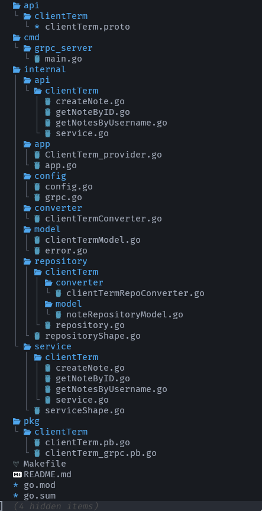

# IT is the cleanest architecture note taking app  
**NOW THIS PROJECT IS IN THE PROCESS OF IMPLEMENTATION**  
This application uses the **GRPC**  and for now the map as repository.  
This app consist of 3 main layers --- API, service and the repository. They exchange information through converters between layers. Each layer has its own interface and models.  

